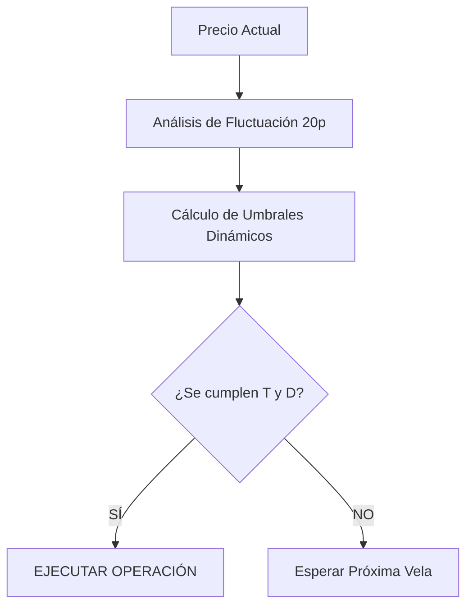

# 📉 Estrategia de Rebote Dinámico (EMA 2/7)

Esta estrategia está inspirada en los sistemas de alta frecuencia y reversión a la media, optimizada para capturar el agotamiento de un movimiento de precio y su posterior "rebote".

## 🚀 Concepto Principal

El bot utiliza dos medias móviles extremadamente rápidas (**EMA 2** y **EMA 7**) y analiza el cuerpo de las velas para detectar momentos donde el precio se ha alejado demasiado de su promedio y es probable un giro inmediato.

### 🧠 El Factor de Fluctuación Dinámica
A diferencia de otros bots, este sistema analiza la **volatilidad reciente** (las últimas 20 velas). Si el mercado está muy movido, el bot exige velas más grandes y distancias más amplias para entrar, evitando ser "atrapado" por el ruido del mercado.

---

## 🛠️ Indicadores Técnicos

| Indicador | Función |
| :--- | :--- |
| **EMA 2** (Amarilla) | Media ultra-rápida que sigue el precio casi al instante. |
| **EMA 7** (Azul) | Media de soporte que marca la tendencia inmediata. |
| **Cuerpo de Vela (T)** | Tamaño absoluto entre la apertura y el cierre de la vela. |
| **Distancia EMA (D)** | La separación entre la EMA 2 y la EMA 7. |

---

## 📈 Lógica de Operación

### ✅ Condiciones para COMPRA (CALL)
1. **EMA 2 < EMA 7**: El precio viene cayendo.
2. **Distancia D > Umbral**: Las medias están lo suficientemente separadas (agotamiento).
3. **Vela Roja**: La última vela fue de caída.
4. **Cuerpo T > Umbral**: La caída tuvo fuerza técnica suficiente para un rebote.

### ❌ Condiciones para VENTA (PUT)
1. **EMA 2 > EMA 7**: El precio viene subiendo.
2. **Distancia D > Umbral**: Las medias están separadas (sobre-extensión).
3. **Vela Verde**: La última vela fue de subida.
4. **Cuerpo T > Umbral**: La subida tuvo fuerza suficiente para un agotamiento.

---

## ⚙️ Configuración Sugerida

- **Timeframe**: `1m` (Recomendado para máxima reactividad).
- **Símbolo**: BTC/USDT o ETH/USDT.
- **Gestión de Riesgo**: Se recomienda activar el **Stop Loss** al `0.5%` y **Take Profit** al `0.8%` para asegurar ganancias rápidas.
- **Modo de Venta**: `Gradual` para escalar salidas o `Completa` para cierres rápidos.

---

## 📊 Visualización de la Estrategia

> [!IMPORTANT]
> Los umbrales **T** y **D** no son fijos. El bot los recalcula en cada ciclo:
> `Umbral Actual = Umbral Base * Factor de Fluctuación`

---

## 🚀 Cómo Activar
1. Abre el panel **Configuración de Trading**.
2. Selecciona: `Estrategia de Rebote (EMA 2/7 + Fluctuación Dinámica)`.
3. Haz clic en **Start Trading**.
